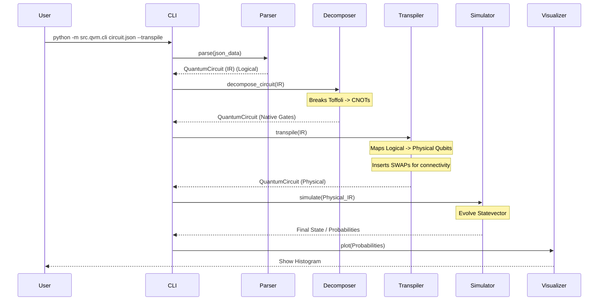

# Execution Flow & Pipeline

This document visualizes the journey of a user's quantum circuit through the QVM system.

## 1. High Level Flowchart



## 2. Step-by-Step Data Transformation

### Step 1: User Input (JSON)
The user provides a high-level description.
```json
[
  {"name": "h", "qubits": [0]},
  {"name": "cx", "qubits": [0, 2]}  // Gap! 0 and 2 might not be connected.
]
```

### Step 2: Intermediate Representation (IR)
The parser creates an object.
```python
QuantumCircuit(
  num_qubits=3,
  operations=[
    {'name': 'h', 'qubits': [0]},
    {'name': 'cx', 'qubits': [0, 2]}
  ]
)
```

### Step 3: Transpilation (Routing)
The transpiler sees that `0` and `2` are not connected on a Linear Chain `0-1-2`.
It decides to swap `1` and `2` (or `0` and `1`) to bring them close.
Let's say it swaps `1` and `2`.
**New Physical Circuit:**
```python
operations=[
  {'name': 'h', 'qubits': [0]},
  {'name': 'swap', 'qubits': [1, 2]}, // Move physical 2 to pos 1? No, usually swap logicals.
  // Actually, standard greedy swaps logical qubit towards target.
  // Path 0->1->2.
  // Swap(0, 1) -> Logical 0 is now at Physical 1.
  // Now connected to Physical 2? Yes.
  {'name': 'swap', 'qubits': [0, 1]}, 
  {'name': 'cx', 'qubits': [1, 2]}   // Applied on physical 1 (was log 0) and physical 2 (log 2)
]
```

### Step 4: Simulation (Vector Evolution)
Start: $|000\rangle = [1, 0, 0, ...]$ (Little Endian q0).
1.  **H(0):** State becomes $\frac{1}{\sqrt{2}}(|000\rangle + |001\rangle)$.
2.  **SWAP(0, 1):** Swaps q0 and q1. State becomes $\frac{1}{\sqrt{2}}(|000\rangle + |010\rangle)$.
3.  **CNOT(1, 2):** Control q1, Target q2.
    *   $|000\rangle$: q1=0 -> No change.
    *   $|010\rangle$: q1=1 -> Flip q2 -> $|110\rangle$.
    *   Result: $\frac{1}{\sqrt{2}}(|000\rangle + |110\rangle)$.

### Step 5: Visualization
The visualizer plots the probabilities:
*   State `000`: 50%
*   State `110`: 50%
(Note: Users interpret these bits based on the final physical mapping or assume the system tracks it. *Current limitation: The final CLI output uses physical qubit indices. A robust system would inverse-map the results.*)

```