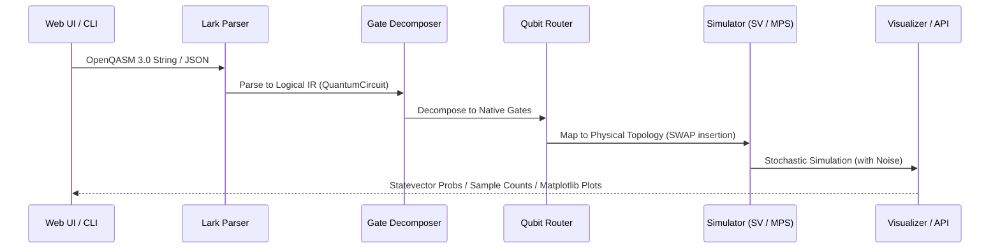

# 🌀 Quantum Virtual Machine (QVM) Knowledge Vault

Welcome to the central knowledge vault for the **Quantum Virtual Machine (QVM)**, a hardware-agnostic quantum execution runtime designed under the "Write Once, Run Anywhere" (WORA) philosophy. 

This Obsidian vault maps out the core compiler components, parser engines, topological mapping transpilers, simulation engines (Statevector and Matrix Product State), noise models, variational quantum algorithms, and API layers that power the system.

---

## 🗺️ Navigation Map of Content (MoC)

Select a node to dive into the technical specifications and mathematical definitions:

```mermaid
graph TD
    Home[[000_QVM_Home]] --> SysArch[[100_System_Architecture]]
    Home --> Parser[[200_OpenQASM3_Parsing_and_AST]]
    Home --> IR[[300_Intermediate_Representation]]
    Home --> Transpiler[[400_Transpilation_and_Routing]]
    Home --> Decomposer[[450_Gate_Decomposition]]
    Home --> Statevector[[500_Exact_Statevector_Simulation]]
    Home --> MPS[[550_Matrix_Product_State_Simulation]]
    Home --> Noise[[600_Noise_and_Hardware_Profiles]]
    Home --> VQA[[700_Variational_Quantum_Algorithms]]
    Home --> WebAPI[[800_Web_API_and_Dashboard]]
```

### 🏢 1. System Design & Intermediate Representation
* **[System Architecture](/docs/100_System_Architecture)**: The high-level architectural pipeline, decoupling layers, and external library interfaces (Qiskit, Cirq).
* **[Intermediate Representation](/docs/300_Intermediate_Representation)**: The central data container (`QuantumCircuit`), parameter bindings (`Parameter`, `ParameterExpression`), and JSON/OpenQASM serialization definitions.

### 📡 2. Input Ingestion & Compiler Frontend
* **[OpenQASM3 Parsing and AST](/docs/200_OpenQASM3_Parsing_and_AST)**: Lark grammar parser specifications (`qasm3.lark`), AST processing, and translation of classical flow statements (while/for loops, conditional branches).

### ⚙️ 3. Transpilation & Topology Routing
* **[Transpilation and Routing](/docs/400_Transpilation_and_Routing)**: Graph connectivity constraints (`TargetArchitecture`), pathfinding mapping, and comparative analysis of **Greedy (BFS)** routing versus **SABRE** lookahead heuristics.
* **[Gate Decomposition](/docs/450_Gate_Decomposition)**: Decomposing non-native gates (e.g. Toffoli/CCX) into hardware-primitive basis sets (`id, rz, sx, x, cx`).

### 🧮 4. Execution Engines (Simulators)
* **[Exact Statevector Simulation](/docs/500_Exact_Statevector_Simulation)**: Exact statevector linear algebra operations, Kronecker tensor-product construction, vectorized index permutation maps for multi-qubit gates, projective measurement, and classical register updates.
* **[Matrix Product State Simulation](/docs/550_Matrix_Product_State_Simulation)**: 1D Tensor Network simulator using Matrix Product State chains of 3-rank tensors, SVD-based bond-dimension truncation, local gate contraction, and measurement collapse.

### 🌡️ 5. Noise & Quantum Hardware Profiling
* **[Noise and Hardware Profiles](/docs/600_Noise_and_Hardware_Profiles)**: Composable noise system using Monte Carlo Kraus trajectories, thermal relaxation models ($T_1, T_2$), readout confusion matrices, and physical hardware profiles (IBM Manila/Lagos).

### 🧬 6. Variational & Application Layers
* **[Variational Quantum Algorithms](/docs/700_Variational_Quantum_Algorithms)**: Variational Quantum Eigensolver (VQE) and Quantum Approximate Optimization Algorithm (QAOA) implementations, analytical gradients (Parameter Shift Rule), and scipy minimizer configurations.
* **[Web API and Dashboard](/docs/800_Web_API_and_Dashboard)**: FastAPI endpoint specification, request/response payload structures, CLI mapping, and the interactive dashboard user interface.

---

## 🚀 Architectural Pipeline Flow

Every circuit executed in the QVM moves linearly through the following transformation pipeline:

