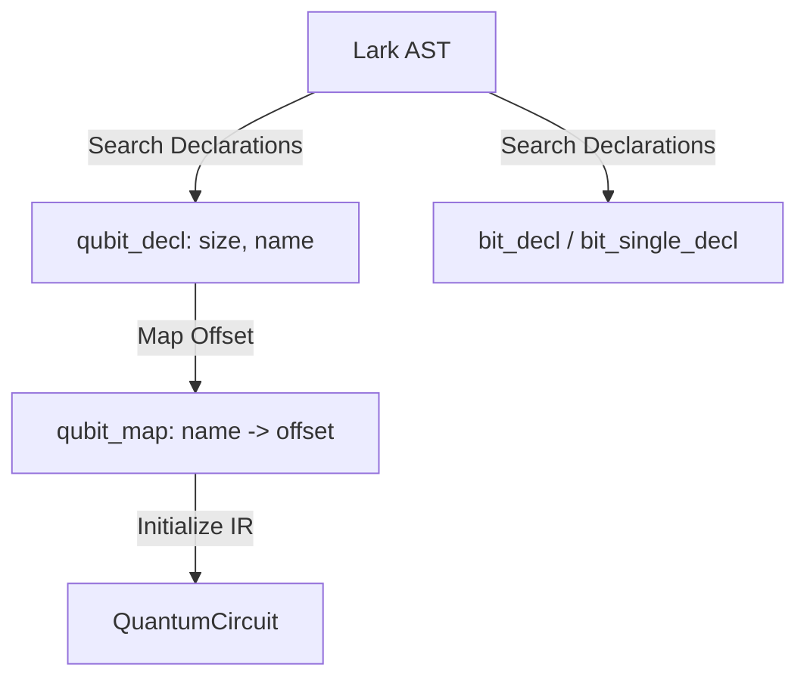

# 📡 OpenQASM 3.0 Parsing and AST Translation

The ingestion module parses OpenQASM 3.0 source text into the system's intermediate representation. It handles qubit declarations, classical bit manipulation, loop mechanisms, and conditional branching.

---

## 📐 The Lark Grammar Subset (`qasm3.lark`)

The parser utilizes the **Lark LALR(1)** parser engine. The grammar rules defined in [qasm3.lark](https://github.com/qayumXD/quantum-virtual-machine/blob/main/src/qvm/qasm3.lark) target a specific subset of OpenQASM 3.0:

*   **Declarations**: Supports quantum register arrays (`qubit[size] name;`) and classical bit arrays (`bit[size] name;` or single bits `bit name;`).
*   **Gate Operations**: Direct gates with parameters (`rx(0.5) q[0];`) and multi-qubit assignments.
*   **Classical Logic**: Direct assignments and bitwise operations (`&`, `|`, `^`, `~`).
*   **Control Flow**: If statements, range-based `for` loops, and `while` loops.

---

## 🔧 Parsing Pipeline (`qasm3_parser.py`)

The parsing process in [qasm3_parser.py](https://github.com/qayumXD/quantum-virtual-machine/blob/main/src/qvm/qasm3_parser.py) executes in two sequential passes over the syntax tree:

### 1. First Pass: Declarations & Sizing
The parser traverses the tree to find all declaration nodes (`qubit_decl`, `bit_decl`, `bit_single_decl`). It registers classical variables and tracks the global physical qubit register size:



Since the QVM utilizes a single flat quantum array, named qubit registers are mapped to sequential indices. For example, declaring:
```qasm
qubit[2] q;
qubit[3] r;
```
creates a mapping: `q[0]` $\to 0$, `q[1]` $\to 1$, `r[0]` $\to 2$, `r[1]` $\to 3$, `r[2]` $\to 4$. The global `QuantumCircuit` is initialized with $5$ qubits.

### 2. Second Pass: Operational Translation & Control flow
The AST nodes are recursively processed. The parser handles complex classical logic and control structures, translating them into flat instructions:

```python
def _process_node(self, node, current_condition):
    # Process gates, measurements, loops, and conditional statements...
```

#### A. Direct Mapping & Conditions
Basic gates (`gate_call` or `measurement`) are converted into operation dicts. If the current block is nested within an `if` block, a `condition` dictionary (e.g. `{"register": "c", "index": 0, "value": 1}`) is passed down and appended to the operation.

#### B. Range-based `for` loops (Compile-Time Unrolling)
OpenQASM `for` loops are unrolled at parse-time. The parser evaluates the loop limits and repeats the body instructions:
```python
elif node.data == "for_loop":
    start_val = int(node.children[1].children[0])
    end_val = int(node.children[1].children[1])
    program_block = node.children[2]
    for _ in range(start_val, end_val):
        for stmt in program_block.children:
            self._process_node(stmt, current_condition)
```

#### C. `while` loops (Program Counter Jumps)
Since `while` loops cannot be unrolled at compile-time (their execution depends on run-time classical variables), they are mapped to structural jump instructions using labels:
```python
elif node.data == "while_loop":
    condition = self._evaluate(node.children[0])
    program_block = node.children[1]
    label_id = self._label_counter
    self._label_counter += 1
    start_label = f"while_start_{label_id}"
    
    # 1. Emit starting label
    self.qc.add_operation("label", [], label=start_label)
    # 2. Process body statements
    for stmt in program_block.children:
        self._process_node(stmt, current_condition)
    # 3. Emit conditional jump back to start
    self.qc.add_operation("jump", [], condition=condition, jump_to=start_label)
```

---

## 🧮 Classical Bitwise Operations
The parser evaluates classical logical expressions and converts them into structured classical calculations (`classical_op` in the IR). 

For example, a classical assignment like:
```qasm
c[1] = c[0] & ~d[0];
```
is parsed into a boolean tree and translated to:
*   `op`: `&`
*   `target`: `("c", 1)`
*   `args`: `[("c", 0), {"op": "~", "args": [("d", 0)]}]` (nested logic is evaluated at run-time by the simulator's classical engine).
