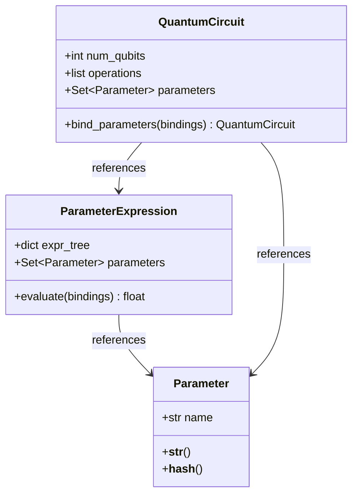

# 📦 Intermediate Representation (IR) & Parameterization

The intermediate representation acts as the decoupled bridge between frontend parser structures and backend simulators. The core representation class is `QuantumCircuit`, defined in [ir.py](https://github.com/qayumXD/quantum-virtual-machine/blob/main/src/qvm/ir.py).

---

## 💾 The `QuantumCircuit` Container

The `QuantumCircuit` class represents the logical structure of a quantum program. It tracks the physical qubit count, registers, and operations list:

```python
class QuantumCircuit:
    def __init__(self, num_qubits: int):
        self.num_qubits = num_qubits
        self.operations = []                  # Flat list of operation dictionaries
        self.classical_registers: Dict[str, int] = {}  # Map: name -> size
```

### 1. Operations Representation Schema
Each instruction in the `operations` array is a dictionary containing structural descriptors:

```python
operation = {
    "name": str,            # E.g., "h", "cx", "measure", "classical_op", "label", "jump", "delay"
    "qubits": List[int],    # Qubit indices (logical or physical depending on pipeline stage)
    "params": List[Union[int, float, Parameter, ParameterExpression]], # Angle values / variables
    "condition": Optional[dict],  # None or {"register": str, "index": int, "value": int}
    "target_bit": Optional[Tuple[str, int]], # For measurement targets: (register_name, index)
    "duration": Optional[str],    # Delay timing e.g. "10ns"
    "label": Optional[str],       # Branch label identifier
    "jump_to": Optional[str],     # Jump destination identifier
    "classical_op": Optional[dict] # Classical calculation definition
}
```

### 2. Validation Constraints
The `add_operation` method validates incoming operations against a strict gate specification registry (`GATE_SPEC`):
*   Validates gate name support.
*   Ensures qubit counts match the gate type.
*   Ensures qubit indices are within range: $0 \le q < \text{num\_qubits}$.
*   Validates parameters list size and parameter types (e.g. `Parameter` or float/int).

---

## 🧬 Parameterized Circuit Design

To support Variational Quantum Algorithms (like VQE and QAOA), QVM provides symbolic parameter structures defined in [parameter.py](https://github.com/qayumXD/quantum-virtual-machine/blob/main/src/qvm/parameter.py):



### 1. Symbolic Calculations
`Parameter` represents a named variable (e.g., $\theta$ or $\beta$). A `ParameterExpression` wraps mathematical operations (addition, subtraction, multiplication) on those parameters, forming an expression tree. This allows users to pass expressions like `2 * beta` as gate parameters.

### 2. Parameter Binding Workflow
Before simulating a circuit, symbolic parameters must be substituted with concrete floating-point values:

```python
# Bind values: returns a new QuantumCircuit instance with no unbound parameters
bindings = {theta: 0.15, beta: 0.82}
concrete_circuit = parameterized_circuit.bind_parameters(bindings)
```
If the binding process leaves any parameters unbound, a `ValueError` is raised, preventing the simulator from executing incomplete instruction lists.

---

## 🗃️ Serialization & Export Formats

The IR provides built-in utilities to export logical and physical structures to different representations:

### 1. JSON Representation (`to_json` / `from_json`)
Serializes the state of the circuit (qubit counts, classical registers, and operations array) to JSON string format. This is the primary format used to communicate with the FastAPI backend.

### 2. OpenQASM 3.0 Generation (`to_qasm`)
Generates standardized OpenQASM 3.0 source text representing the circuit. It formats registers, gate operations, parameters, and measurement statements:
```qasm
OPENQASM 3.0;
qubit[2] q;
bit[2] c;
h q[0];
cx q[0], q[1];
c[0] = measure q[0];
```

### 3. OpenQASM 2.0 Export (`to_openqasm2`)
Defined in [src/qvm/util/export.py](https://github.com/qayumXD/quantum-virtual-machine/blob/main/src/qvm/util/export.py). It maps operations into OpenQASM 2.0 standard syntax:
*   Decomposes non-native gates into basic equivalents (e.g. `swap` is automatically unrolled into three sequential CNOT gates).
*   Logs warnings for unsupported instructions to ensure compatibility with older execution devices.
