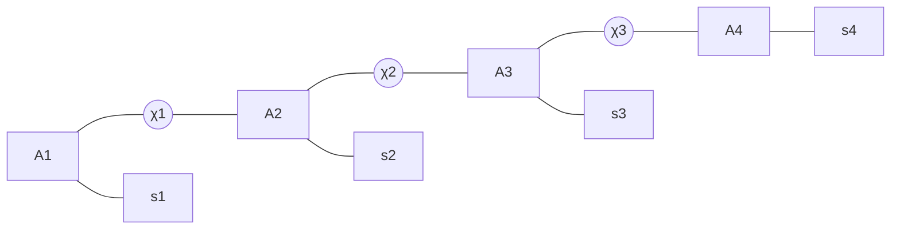
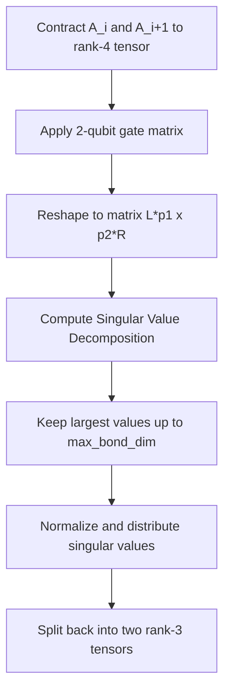

# 🧱 Matrix Product State (MPS) Simulation

For circuits with larger qubit counts (e.g., $N > 12$), standard statevector simulation becomes memory-prohibitive due to the exponential growth of the state space ($2^N$ complex floats). The `MPSSimulator`, defined in [mps_simulator.py](https://github.com/qayumXD/quantum-virtual-machine/blob/main/src/qvm/mps_simulator.py), uses a **Tensor Network** representation to simulate low-entanglement quantum circuits up to 20+ qubits.

---

## 📐 Tensor Network Representation

Instead of storing a single vector of size $2^N$, the Matrix Product State (MPS) model factorizes the state $|\psi\rangle$ into a 1D chain of $N$ local tensors, one for each qubit:



Each local tensor $A^{[i]}$ is a rank-3 tensor of shape $(L_i, p_i, R_i)$:
*   $p_i$: Physical index dimension ($2$ for qubits, representing $|0\rangle$ and $|1\rangle$).
*   $L_i$: Left virtual bond index.
*   $R_i$: Right virtual bond index.
*   $\chi_i$: Bond dimension (dimension of the virtual indices), which scales with the amount of entanglement between qubits.

The global state vector is reconstructed by contracting the virtual indices:
$$ \psi_{s_1 s_2 \dots s_N} = \sum_{\alpha_1 \dots \alpha_{N-1}} A^{[1]}_{1, s_1, \alpha_1} A^{[2]}_{\alpha_1, s_2, \alpha_2} \dots A^{[N]}_{\alpha_{N-1}, s_N, 1} $$

The simulator starts in the $|00\dots0\rangle$ state, represented by bond dimensions of $1$:
```python
# Initial state tensors mapping
self.tensors = [np.array([[[1.0], [0.0]]], dtype=complex) for _ in range(n)]
```

---

## ⚡ Gate Application Mechanics

### 1. Single-Qubit Gates (Local Contraction)
Applying a gate to qubit $i$ only affects its local tensor $A^{[i]}$. The simulator contracts the gate matrix with the physical index of $A^{[i]}$, which does not change the bond dimensions:

$$ A^{[i] \text{ new}}_{\alpha_{i-1}, s_i^{\text{new}}, \alpha_i} = \sum_{s_i} A^{[i]}_{\alpha_{i-1}, s_i, \alpha_i} \cdot U_{s_i^{\text{new}}, s_i} $$

```python
def _apply_single_qubit(self, q, gate):
    # Contract physical index 'j' with gate index 'j'
    self.tensors[q] = np.einsum('ijk,aj->iak', self.tensors[q], gate)
```

---

### 2. Two-Qubit Gates (Contract, SVD, and Truncate)
For a two-qubit gate (like CNOT) acting on adjacent qubits $i$ and $i+1$:



1.  **Contract**: Combine adjacent tensors $A^{[i]}$ and $A^{[i+1]}$ into a single rank-4 tensor of shape $(L_i, p_i, p_{i+1}, R_{i+1})$:
    ```python
    combined = np.einsum('ijk,klm->ijlm', self.tensors[q1], self.tensors[q2])
    ```
2.  **Apply Gate**: Multiply by the $4 \times 4$ gate matrix (e.g. CNOT).
3.  **Reshape**: Reshape the tensor into a matrix of shape $(L_i \cdot p_i, p_{i+1} \cdot R_{i+1})$.
4.  **SVD**: Compute the Singular Value Decomposition (SVD):
    $$ M = U S V^\dagger $$
5.  **Truncate**: Keep only the largest $k$ singular values, up to `max_bond_dim` (default $16$). This step discards high-frequency entanglement to keep the tensors compressed.
6.  **Reconstruct**: Re-normalize, split the singular values, and reshape the matrices back into two rank-3 tensors $A^{[i]}$ and $A^{[i+1]}$.

---

## ⚠️ Nearest-Neighbor Connectivity Constraint

Because the SVD step splits adjacent tensors in the 1D chain, the MPS simulator only supports gates between adjacent qubits:
$$ |q_1 - q_2| == 1 $$

If a two-qubit gate is applied to non-adjacent qubits, the simulator raises a `ValueError`. This enforces the use of the transpiler's SWAP insertion routing.

---

## 📉 Projective Measurements on MPS

To measure qubit $q$, the simulator projects its local tensor and re-normalizes the state:

1.  **Calculate Probability**: Computes the probability of measuring $|0\rangle$ by contracting the physical index for state $|0\rangle$:
    ```python
    prob_0 = np.sum(np.abs(tensors[q][:, 0, :])**2)
    ```
2.  **State Collapse**: Based on a random sample:
    *   If $0$: zero out the $|1\rangle$ entry: `tensors[q][:, 1, :] = 0`.
    *   If $1$: zero out the $|0\rangle$ entry: `tensors[q][:, 0, :] = 0`.
3.  **Renormalize**: Renormalizes the tensor:
    ```python
    norm = np.linalg.norm(self.tensors[q])
    if norm > 0:
        self.tensors[q] = self.tensors[q] / norm
    ```
