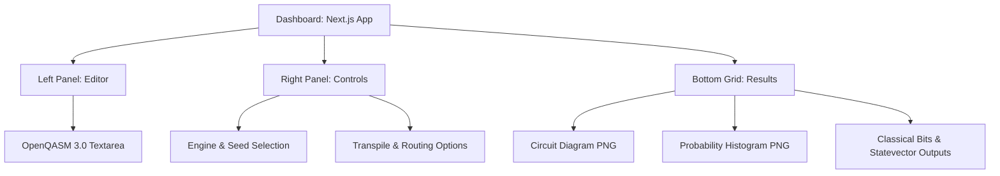

# 800 Web API and Dashboard Interface

The QVM exposes a web interface to allow users to interactively build circuits, configure compiler/simulator engines, run simulations, view historical executions, and view results. This is implemented via a **FastAPI backend** in [api/app.py](https://github.com/qayumXD/quantum-virtual-machine/blob/main/api/app.py) and a **Next.js React dashboard** in [web/src/app/page.tsx](https://github.com/qayumXD/quantum-virtual-machine/blob/main/web/src/app/page.tsx).

---

## 🔌 FastAPI Routing & Endpoints

The API server (`api/app.py`) runs on standard port `8000` (started by `src/qvm/server.py`). It exposes the following REST endpoints:

*   **`GET /`**: Serves the Next.js production build.
*   **`GET /health`**: Simple healthcheck route returning `{"status": "ok"}`.
*   **`POST /run`**: The main execution endpoint. It accepts a `RunRequest` JSON payload, runs the compilation and simulation steps, and returns a `RunResponse` JSON payload.

---

## 📥 RunRequest Schema

The request payload allows full configuration of the execution pipeline:

| Field Name | Type | Default | Description |
| :--- | :--- | :--- | :--- |
| `source_type` | `Literal["json", "qasm"]` | `"json"` | Format of input circuit definition. |
| `circuit` | `List[dict]` | `None` | Gate list when `source_type="json"`. |
| `qasm` | `str` | `None` | OpenQASM code text when `source_type="qasm"`. Handles OpenQASM 3.0 and 2.0. |
| `nqubits` | `int` | `None` | Number of qubits (required for JSON inputs). |
| `transpile` | `bool` | `False` | Enable mapping routing stage. |
| `routing` | `Literal["greedy", "sabre"]` | `"greedy"` | Router pathfinding algorithm to apply. |
| `restore_mapping` | `bool` | `True` | Restore initial qubit index map after SABRE. |
| `engine` | `Literal["statevector", "mps"]` | `"statevector"` | Simulation engine backend. |
| `seed` | `int` | `None` | Random number generator seed. |
| `shots` | `int` | `0` | If $> 0$, runs shot-based sampling instead of exact probabilities. |
| `noise_depol` | `float` | `0.0` | Global depolarizing noise rate ($0$ to $1$). |
| `noise_readout` | `float` | `0.0` | Global readout flip rate ($0$ to $1$). |
| `noise_amp_damp` | `float` | `0.0` | Global amplitude damping ($T_1$) rate. |
| `noise_phase_damp`| `float` | `0.0` | Global phase damping ($T_2$) rate. |
| `device_backend` | `str` | `None` | Predefined hardware profile (e.g. `"fake_5q"`, `"fake_7q"`). |
| `expectation_pauli`| `Dict[str, float]` | `None` | Pauli string mapping to coefficients for expectation value calculation. |

---

## 📤 RunResponse Schema

The response payload contains the execution results and visualizations:

| Field Name | Type | Description |
| :--- | :--- | :--- |
| `probabilities` | `List[float]` | Exact quantum state probabilities for all $2^N$ states. |
| `classical_memory`| `dict` | Final state of named classical bit registers. |
| `transpiled_operations` | `List[dict]` | The final circuit operations array after routing and decomposition. |
| `nqubits` | `int` | The physical qubit count used. |
| `circuit_plot` | `str` | Base64-encoded PNG image of the circuit diagram. |
| `histogram_plot` | `str` | Base64-encoded PNG image of the probability histogram. |
| `counts` | `dict` | Shot-based sampling measurement outcomes (if `shots > 0`). |
| `openqasm2` | `str` | Equivalent compiled circuit exported to OpenQASM 2.0. |
| `expectation_value`| `float` | Computed expectation value $\langle H \rangle$ (if requested). |
| `noise_summary` | `str` | Text summary of the noise channels applied. |

---

## 🎨 Visualization Engine

The backend generates visual plots using Matplotlib (`src/qvm/visual.py`) and converts them to base64 strings so they can be embedded directly in the web UI:

```python
def fig_to_base64(fig):
    buf = io.BytesIO()
    fig.savefig(buf, format="png", bbox_inches='tight')
    buf.seek(0)
    img_str = base64.b64encode(buf.read()).decode("utf-8")
    plt.close(fig)
    return img_str
```

*   `plot_circuit`: Renders a symbolic diagram of the circuit showing gates, controls, and measurements.
*   `plot_histogram`: Plots a bar chart of the basis state probabilities.

---

## 🖥️ Web Client Dashboard Interface (Next.js Dashboard)

The dashboard provides a single-page workspace layout:



### Dashboard Workflow:
1.  The user writes an OpenQASM 3.0 script in the text editor.
2.  Configures the simulation engine, seed, and transpilation settings in the left/middle configuration panels.
3.  Clicks **Run**.
4.  The client makes an asynchronous `fetch("/run")` POST call to the backend.
5.  On success, the React component updates its state (`setResults(data)`), which automatically re-renders the visual plots (circuit diagram, probability histogram), classical memory, and prints logs into the bottom **Terminal Output** container.

