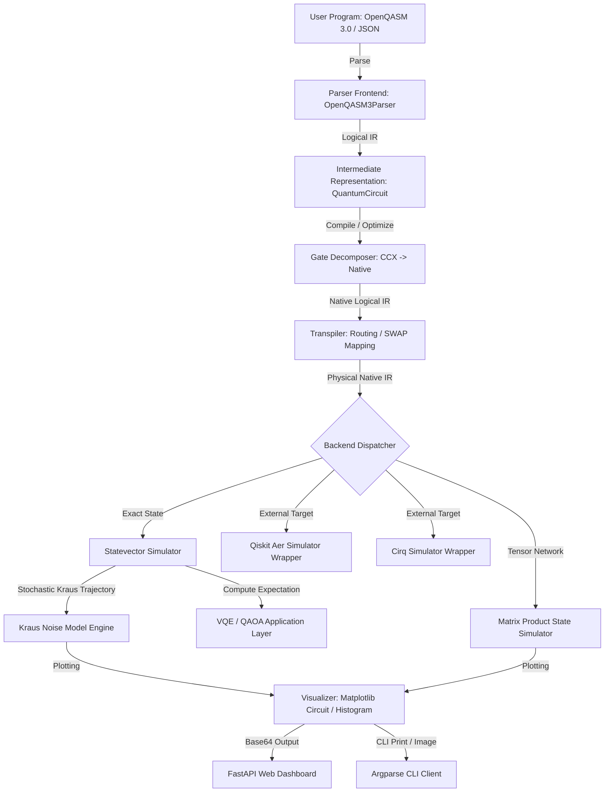

# 🏗️ System Architecture & External SDK Boundaries

The Quantum Virtual Machine (QVM) is structured as a modular, hardware-agnostic compilation and execution environment. To ensure high extensibility, it decouples circuit ingest formats, intermediate representations, architectural constraints, and simulation engines.

---

## 🗺️ Architectural Topology

The system follows a strict **Pipeline Architecture Pattern**. User programs flow through a series of decoupled transformations before execution:

---

## 📂 Monorepo Modular Structure

The codebase is organized to maintain a clear boundary between frontend parsing, core intermediate models, execution backends, and user interfaces:

*   **`src/qvm/`**: Core library modules
    *   [ir.py](file:///home/qayum/projects/quantum-virtual-machine/src/qvm/ir.py): Central data structures. Defines `QuantumCircuit` and hooks for external formats.
    *   [parameter.py](file:///home/qayum/projects/quantum-virtual-machine/src/qvm/parameter.py): Math structures for symbolic parameters, expressions, and evaluation bindings.
    *   [parser.py](file:///home/qayum/projects/quantum-virtual-machine/src/qvm/parser.py): Lexer/parsers for JSON payload mapping and OpenQASM 2.0.
    *   [qasm3_parser.py](file:///home/qayum/projects/quantum-virtual-machine/src/qvm/qasm3_parser.py): Lexer/AST converter for OpenQASM 3.0 via Lark grammar specifications.
    *   [architecture.py](file:///home/qayum/projects/quantum-virtual-machine/src/qvm/architecture.py): Data structure defining physical connectivity grids and native gates.
    *   [transpiler.py](file:///home/qayum/projects/quantum-virtual-machine/src/qvm/transpiler.py): Qubit routing algorithms (Greedy and SABRE).
    *   [decomposer.py](file:///home/qayum/projects/quantum-virtual-machine/src/qvm/decomposer.py): Standard compiler gate decomposer (e.g. Toffoli unrolling).
    *   [simulator.py](file:///home/qayum/projects/quantum-virtual-machine/src/qvm/simulator.py): Statevector engine, classical registers, expectation logic, and noise mapping.
    *   [mps_simulator.py](file:///home/qayum/projects/quantum-virtual-machine/src/qvm/mps_simulator.py): Matrix Product State simulator for larger qubit spaces.
    *   [noise.py](file:///home/qayum/projects/quantum-virtual-machine/src/qvm/noise.py): Kraus noise model structures, thermal damping, and hardware backends.
    *   [observable.py](file:///home/qayum/projects/quantum-virtual-machine/src/qvm/observable.py): Hamiltonian definitions and Pauli algebraic operators.
    *   [gradient.py](file:///home/qayum/projects/quantum-virtual-machine/src/qvm/gradient.py): Analytical parameter-shift gradients and finite differences.
    *   [vqe.py](file:///home/qayum/projects/quantum-virtual-machine/src/qvm/vqe.py) & [qaoa.py](file:///home/qayum/projects/quantum-virtual-machine/src/qvm/qaoa.py): Variational algorithm solvers.
    *   [visual.py](file:///home/qayum/projects/quantum-virtual-machine/src/qvm/visual.py): Plotting engines.
    *   [cli.py](file:///home/qayum/projects/quantum-virtual-machine/src/qvm/cli.py) & [server.py](file:///home/qayum/projects/quantum-virtual-machine/src/qvm/server.py): Command Line and API servers.
*   **`api/`**: FastAPI routers
    *   [app.py](file:///home/qayum/projects/quantum-virtual-machine/api/app.py): Exposes HTTP services, wraps run requests, builds custom noise structures, and generates visual plots.
*   **`web/`**: UI dashboard assets
    *   [index.html](file:///home/qayum/projects/quantum-virtual-machine/web/index.html): Clean HTML5/JS dashboard for interactive circuit editing, transpilation parameter adjusting, and histogram inspection.

---

## 🔌 Interoperability and SDK Boundaries

To support QVM as an educational bridge, the `QuantumCircuit` intermediate representation includes wrappers for bidirectional translation between standard frameworks:

### 1. Qiskit Integration
*   **Logical Conversion**: `QuantumCircuit.to_qiskit()` translates internal operations, parameters, and classical registers into `qiskit.QuantumCircuit` structures. Conversely, `QuantumCircuit.from_qiskit()` extracts gates and properties.
*   **Execution Fallback**: `QuantumCircuit.run_qiskit_simulator()` compiles the local circuit and routes execution directly to Qiskit's `AerSimulator` backend.

### 2. Cirq Integration
*   **Logical Conversion**: `QuantumCircuit.to_cirq()` maps local operations onto `cirq.Circuit` pipelines using `cirq.LineQubit` grids. `QuantumCircuit.from_cirq()` reconstructs circuit objects from Cirq structures.
*   **Execution Fallback**: `QuantumCircuit.run_cirq_simulator()` evaluates the circuit on Cirq's standard simulator and translates the results into measurement counts.

> [!NOTE]
> All external SDK dependencies (Qiskit and Cirq) are imported lazily inside [ir.py](file:///home/qayum/projects/quantum-virtual-machine/src/qvm/ir.py) using try-catch blocks. If these packages are not installed, the QVM continues to execute successfully using its internal Statevector and MPS engines.
