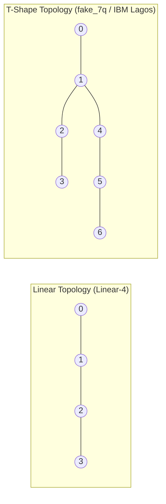
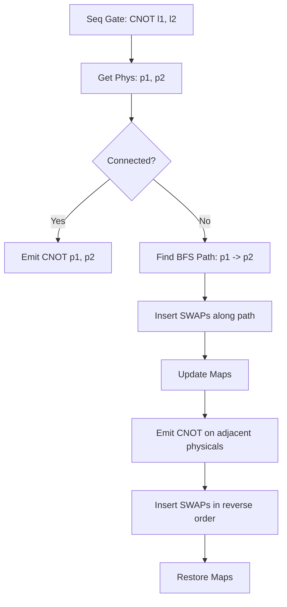

# ⚙️ Transpilation and Qubit Routing

Physical quantum processors impose strict connectivity constraints—not all qubits are directly connected. The transpiler module in [transpiler.py](file:///home/qayum/projects/quantum-virtual-machine/src/qvm/transpiler.py) maps logical circuits onto a physical topology defined by `TargetArchitecture` in [architecture.py](file:///home/qayum/projects/quantum-virtual-machine/src/qvm/architecture.py), inserting `SWAP` gates where necessary.

---

## 🗺️ Physical Topologies (`TargetArchitecture`)

A target architecture is modeled as a bidirectional graph:
*   **Nodes**: Physical qubits $\{0, 1, \dots, N-1\}$.
*   **Edges**: Physical connections where two-qubit gates (like CNOT) can occur natively.



The system provides helper functions to initialize common architectures:
*   `get_linear_architecture(num_qubits)`: Links qubits in a 1D chain: $0-1-\dots-(N-1)$.
*   `get_fully_connected_architecture(num_qubits)`: Connects all qubits (clique). Useful for comparison.

---

## 🚀 Routing Algorithms Comparison

The `Transpiler` class provides two routing strategies. Both maintain a dynamic `qubit_map` (Logical $\to$ Physical) and `inverse_map` (Physical $\to$ Logical) to track the physical location of logical qubits as they move during execution.

---

### 1. Greedy BFS Routing (Default Strategy)

The greedy router processes gates sequentially. Single-qubit gates are mapped directly. For a CNOT on logical qubits $(l_1, l_2)$:

1.  Looks up physical locations: $p_1 = \text{map}[l_1]$ and $p_2 = \text{map}[l_2]$.
2.  If physical qubits are connected ($p_1, p_2 \in E$), it emits the CNOT.
3.  If they are not connected:
    *   Finds the shortest path between $p_1$ and $p_2$ using **Breadth-First Search (BFS)**.
    *   Inserts `SWAP` gates along the path to move the first qubit adjacent to the second.
    *   Updates the mapping tables for each SWAP.
    *   Emits the CNOT on the now-adjacent qubits.
    *   **Swap-Back Restoration**: Inserts the same `SWAP` gates in reverse order to return logical qubits to their original physical positions.



*   **Pros**: Simple, preserves logical mapping at the end of every gate block.
*   **Cons**: High overhead. Inserting double SWAP sequences significantly increases circuit depth.

---

### 2. SABRE-inspired Routing

The SABRE (SWAP-Based Heuristic Routing) strategy optimizes routing globally. It uses a lookahead heuristic to choose SWAPs that benefit both current and future gates:

1.  **Front Layer Queue**: Finds the first set of executable gates (gates whose qubits are already adjacent).
2.  **Lookahead Window**: Evaluates the cost of possible physical SWAPs along active connectivity edges.
3.  **Cost Function**: Computes the distance between physical qubits for active and future gates:
    $$ \text{Cost}(e) = \sum_{g \in \text{Front}} \text{decay}^{\text{idx}(g)} \cdot \text{Distance}(\text{map}[q_1^g], \text{map}[q_2^g]) $$
    where $\text{decay} = 0.6$ weights upcoming gates less than the immediate front layer.
4.  **Best Candidate Selection**: Chooses the SWAP that minimizes the heuristic cost, applies it, updates the maps, and repeats.
5.  **Restore Mapping** (Optional): At the end of the routing process, if `restore_mapping` is enabled, it adds SWAPs to restore the physical mapping back to identity (where logical $i$ is mapped to physical $i$).

```python
best_swap = None
best_cost = math.inf
for edge in self.architecture.connectivity:
    s1, s2 = edge
    self._swap_update_maps(s1, s2, qubit_map, inverse_map) # trial swap
    cost = self._heuristic_cost(ready, qubit_map, decay)
    if cost < best_cost:
         best_cost = cost
         best_swap = (s1, s2)
    self._swap_update_maps(s1, s2, qubit_map, inverse_map) # revert
```

*   **Pros**: Generates significantly shorter circuits by avoiding redundant swap-backs and considering lookahead gates.
*   **Cons**: Heuristics are computationally more expensive than simple BFS.
