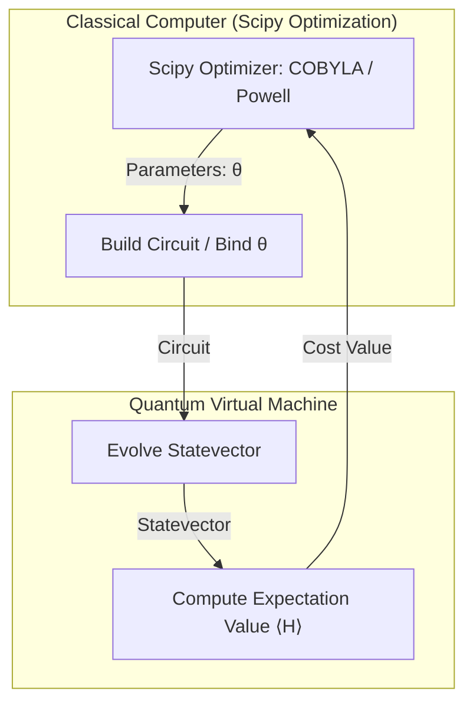

# 🧬 Variational Quantum Algorithms (VQE & QAOA)

Variational Quantum Algorithms (VQAs) are hybrid quantum-classical algorithms. They use a classical optimizer to update the parameters of a quantum circuit (ansatz) to minimize a cost function. QVM implements these algorithms in [vqe.py](file:///home/qayum/projects/quantum-virtual-machine/src/qvm/vqe.py), [qaoa.py](file:///home/qayum/projects/quantum-virtual-machine/src/qvm/qaoa.py), [observable.py](file:///home/qayum/projects/quantum-virtual-machine/src/qvm/observable.py), and [gradient.py](file:///home/qayum/projects/quantum-virtual-machine/src/qvm/gradient.py).

---

## 🧮 Hamiltonians & Observables

A Hamiltonian $H$ represents the energy of a physical system or a cost function to minimize. In QVM, it is represented as a linear combination of Pauli strings (tensor products of $I, X, Y, Z$):
$$ H = \sum_i c_i P_i \quad \text{where} \quad P_i \in \{I, X, Y, Z\}^{\otimes N} $$

*   `PauliOp`: Represents a single term $c_i P_i$.
*   `Hamiltonian`: Tracks a list of `PauliOp` objects. Can construct the full matrix representation in the statevector space:
    ```python
    H_matrix = observable.to_matrix(circuit.num_qubits)
    ```

---

## 🔁 Hybrid Optimization Loop

Both VQE and QAOA operate in a closed feedback loop:



---

## 1. Variational Quantum Eigensolver (VQE)

VQE seeks to find the ground state energy (lowest eigenvalue) of a Hamiltonian:
$$ E_0 \le \langle \psi(\vec{\theta}) | H | \psi(\vec{\theta}) \rangle $$

*   **Ansatz Function**: A parameterized circuit template:
    ```python
    def ansatz(params):
        qc = QuantumCircuit(2)
        qc.add_operation("ry", [0], params=[params[theta]])
        qc.add_operation("cx", [0, 1])
        return qc
    ```
*   **Cost Function**: Computes the exact expectation value:
    $$ \langle H \rangle = \langle \psi(\vec{\theta}) | H | \psi(\vec{\theta}) \rangle = \text{Real}(\psi^\dagger H \psi) $$
*   **Optimizer**: SciPy's `minimize` (e.g. `cobyla`, `powell`, `l-bfgs-b`) updates the parameter array $\vec{\theta}$ to minimize the expectation value.

---

## 2. Quantum Approximate Optimization Algorithm (QAOA)

QAOA is a specialized VQA designed for solving combinatorial optimization problems (e.g. MaxCut).

### A. Circuit Structure
The ansatz alternates between a problem (cost) Hamiltonian layer and a mixer Hamiltonian layer:
1.  **Initial Superposition**: Apply Hadamard gates to all qubits to create state $|+\rangle^{\otimes N}$.
2.  **Cost Unitary Layer**: Apply $e^{-i \gamma_p H_C}$. For $ZZ$ terms in the Hamiltonian, this is unrolled into:
    $$\text{CNOT}(q_a, q_b) \to R_z(2 \gamma_p c_i) \to \text{CNOT}(q_a, q_b)$$
3.  **Mixer Unitary Layer**: Apply $e^{-i \beta_p H_M}$ (implemented as $R_x(2 \beta_p)$ on all qubits).

### B. MaxCut Problem Hamiltonian
For a graph $G = (V, E)$, the MaxCut Hamiltonian is:
$$ H_C = \sum_{(i,j) \in E} \frac{I - Z_i Z_j}{2} $$
QAOA minimizes $-H_C$ to find the configuration that maximizes the cut. The optimal bitstring is extracted by sampling the final optimized state.

---

## 📐 Gradient Calculations

To use gradient-based optimizers (like L-BFGS-B or SLSQP), QVM provides two ways to compute the gradient vector $\vec{\nabla} \langle H \rangle$:

### 1. Analytical Gradients: The Parameter Shift Rule
For parameterized circuits with gates generated by single Pauli operators (like $R_x, R_y, R_z$), the exact derivative of the expectation value with respect to a parameter $\theta_i$ is:
$$ \frac{\partial \langle H \rangle}{\partial \theta_i} = \frac{\langle H(\theta_i + s) \rangle - \langle H(\theta_i - s) \rangle}{2 \sin(s)} $$
where $s$ is a shift parameter (usually $\pi/2$).

This allows QVM to compute exact analytic gradients using only two circuit evaluations per parameter, without numerical approximations:
```python
# Forward shift
forward_values = dict(current_values)
forward_values[param] = current_values[param] + shift
e_forward = simulator.expectation_value(circuit.bind_parameters(forward_values), observable)

# Backward shift
backward_values = dict(current_values)
backward_values[param] = current_values[param] - shift
e_backward = simulator.expectation_value(circuit.bind_parameters(backward_values), observable)

gradient[i] = (e_forward - e_backward) / (2 * np.sin(shift))
```

### 2. Numerical Gradients: Central Finite Difference
A standard numerical fallback:
$$ \frac{\partial \langle H \rangle}{\partial \theta_i} \approx \frac{\langle H(\theta_i + \epsilon) \rangle - \langle H(\theta_i - \epsilon) \rangle}{2 \epsilon} $$
where $\epsilon$ is a small step size (default $10^{-5}$). It is used when the parameter shift rule is not mathematically applicable.
